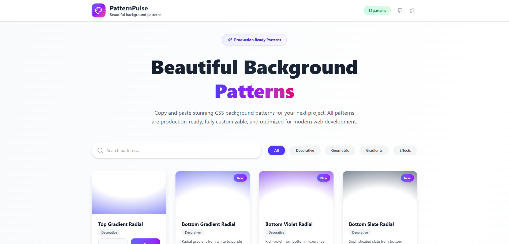

# 🎨 PatternPulse


## A curated collection of beautiful, production-ready CSS background patterns and gradients.

👉 **[Live Demo](https://pattern-pulse.vercel.app/)**

---



---

## 📖 About The Project

**PatternPulse** is a modern web tool built for developers and designers. It provides a curated collection of professional-grade CSS background patterns that can be integrated into any project with a simple copy-paste — with **zero dependencies**.

Its goal is to help frontend developers and designers quickly find and apply visually appealing background patterns using modern CSS techniques — all through an intuitive interface and clean, scalable codebase.

---

## 🌟 Features

| Feature               | Description                                                                 |
|-----------------------|-----------------------------------------------------------------------------|
| 🎨 Live Preview        | Instantly see how each pattern looks before using it                        |
| 📋 One-click Copy      | Copy production-ready CSS code in one click                                 |
| 🗂️ Pattern Categories   | Organized by types: geometric, gradients, effects, etc.                     |
| 🔍 Search + Filter      | Search by name or filter by category                                        |
| 📱 Responsive Design    | Works seamlessly across all devices                                         |
| 💡 Modern Stack         | Built with React, TypeScript, Tailwind CSS                                 |
| 🔒 Zero Dependencies    | All patterns use pure CSS — no JS libraries required                        |
| 💾 MIT Licensed         | Free for commercial and personal use                                        |

---

## ⚙️ Tech Stack

- **Framework**: React
- **Language**: TypeScript
- **Styling**: Tailwind CSS
- **Build Tool**: Vite
- **Icons**: Lucide React
- **Linting**: ESLint + typescript-eslint + react-x

---

## 🚀 Getting Started

### Prerequisites

- Node.js **v18+**
- A package manager (npm, yarn, or pnpm)

### Installation

```bash
git clone https://github.com/Tusho7/pattern-pulse.git
cd pattern-pulse
npm install
npm run dev
